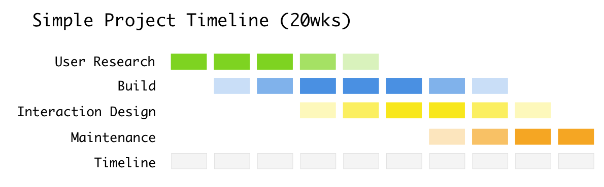
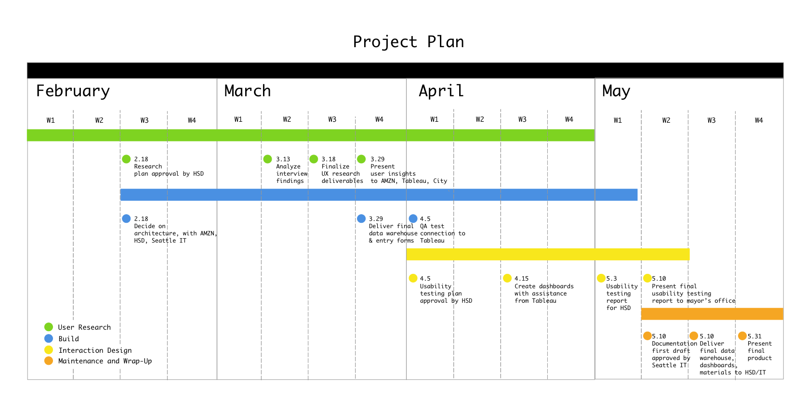
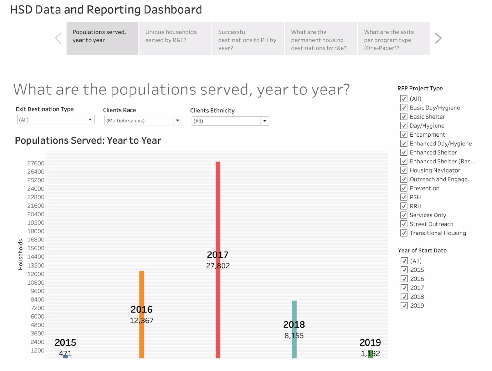

## 🎬 Video

<iframe width="560" height="315"
src="https://www.youtube.com/embed/CHX1ZGw5k_o" 
frameborder="0" 
allow="accelerometer; autoplay; encrypted-media; gyroscope; picture-in-picture" 
allowfullscreen></iframe>

## 🤔 Problem Space
Homelessness is a serious issue in Seattle, so much so that it has gotten national attention. It's also highly contentious; everyone everywhere has an opinion about it, and how the government is (or isn't; or could; or should) be handling things.

The City of Seattle Human Services Department (HSD) contracts with community organizations to provide housing & health services to people experiencing homelessness. This program & contract data describes the resources each organization gets and the populations it serves.

Before this project, Human Services staff pieced together program & contract data from many sources. This is a time-consuming and frustrating process, but this information is critical for informing policy and highly visible through media outreach. The City needed a system to capture institutional knowledge, automate data ingest, and makes data analysis more streamlined and trustworthy. My team, the Rolling Capstones, sought to provide this solution to the City. We partnered with **Amazon Web Services (AWS)** and **Tableau** for this work. The partners offered us strategic guidance and access to tools, but we did the work ourselves.

## 📝 Initial Planning
        
This project was around six months of work, with approximately one month of up-front planning and five months of execution. We initially scoped it across four phases.

When we added more detail, it became evident that each of these phases would not have the same amount of time devoted to it, and that they might run concurrently.

## 🎨 Design
          
To learn about the problem space, we interviewed several domain experts. We analyzed the major themes that emerged from our interviews and used the insights to inform the way we display information and our approach to the project.

It was important for us to involve different stakeholders in our design process. AWS hosted a "Working Backwards" workshop to help flesh out user requirements. Working Backwards is their outcome-focused method for product development, and thinking of the solution we would build for City staff with the outcome in mind was a great exercise in level-setting for the project.

Tableau collaborated with us on the design strategy for the reporting dashboards by providing guidance and training. We went through several iterations of data warehouse development before producing the final SSIS package ready for production. Most importantly, we tested and sought feedback at every stage of the process to make sure we were understanding things correctly.

## 💪 Work
We knew we had to build some means to clean, structure, and ingest data. Our ETL pipeline consisted of a series of scripts written in Microsoft SQL Server. A job on the server watches a folder to see if new files need to be uploaded to the database. After ingest, the data is validated for proper typing and then brought from staging into production.

We took the existing system for reporting (a Tableau dashboard) and shifted much of the logic that lived in calculated fields into the database itself. That way, users have to worry less about the validation of data, and can try out more interesting analyses.

Here's an example of what the dashboard looks like, populated with dummy data:

## 🕰 Future Work & Outcomes
Our hope is that our solution can help HSD tell a more complete story about how the City is serving its most vulnerable populations. Part of this work means taking a look at the current state of things at the city in addition to our technical tools.

Throughout our project, we audited business processes to better understand where later improvements could be made. Broadly, these consist of improvements for personnel training/job duties and technical architecture. We hope the City takes some of these ideas into consideration when they start to build out version 2.0 of our system.

I was [interviewed](https://ischool.uw.edu/news/2019/05/msim-students-help-seattle-better-serve-homeless-people) about this project, [won Best in Class](https://ischool.uw.edu/news/2019/06/capstone-puts-students-skills-display) on project presentation night, and got a thank you note from the Mayor herself. My colleague [Tiffany Ku](https://www.tkku.me/#/city-of-seattle/) documented her perspective on the project as well.