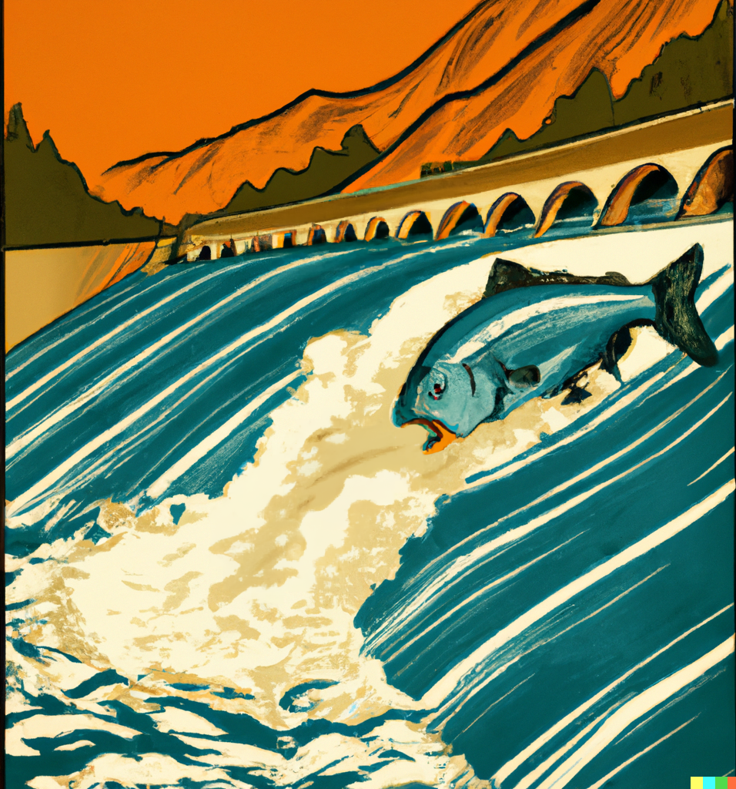

[This page is a link to my essay](https://thegradient.pub/salmon-in-the-loop/) about fish counting and digital transformation in large-scale organizations. I am happy to talk about my experience either writing the essay for publication or any details in the essay itself.