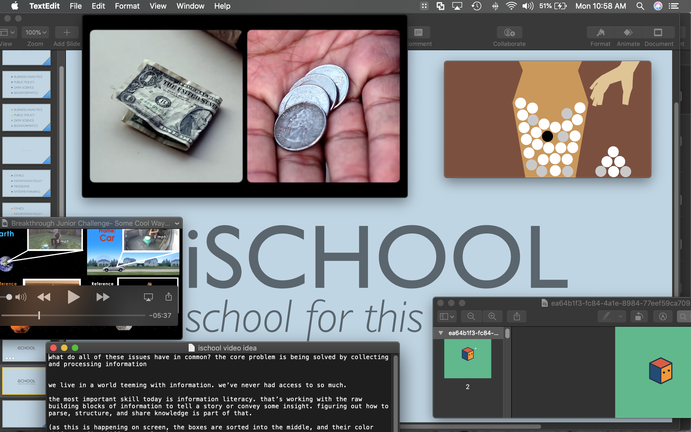
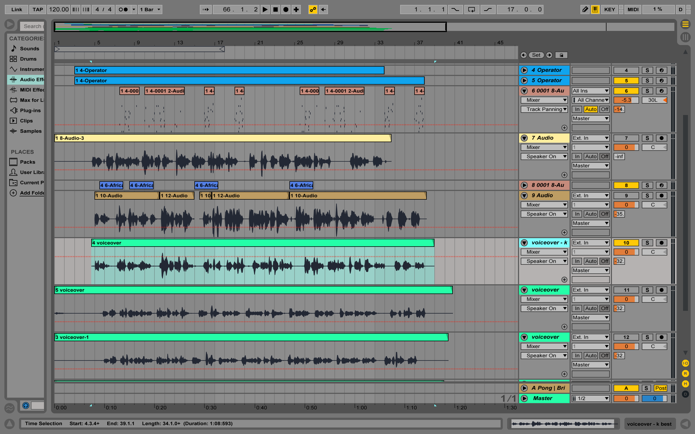

## 🎬 Video
<iframe src="https://player.vimeo.com/video/147389407" width="480" height="270" frameborder="0" webkitallowfullscreen mozallowfullscreen allowfullscreen></iframe>

## 🤔 Problem Space
I participated in a video contest for the iConference, a global consortium of information schools. The goal was to make a promotional video explaining the relevance of iSchools. I won second place. My project was the only entry produced by an individual.

The prize was a lump sum of cash and an expenses-paid trip to the conference in Philadelphia that year. I consider attending this conference as one of the reasons I elected to pursue a Masters degree.

## 📝 Process
As a challenge, I made the video exclusively using three pieces of software: Keynote, iMovie, and Ableton Live. I made simple keyframe animations using Keynote and then cut them together in iMovie.

I was inspired by a video about AI from the philosophy of Nick Bostrom, [a video by Radiolab about symmetry](https://www.youtube.com/watch?v=zEQskIsHKT8), and a [video about the explanation of relativity by a young physicist](https://www.youtube.com/watch?v=umLcFAI5SZg). I also collected a series of simple animated GIFs whose aesthetics I found simple, yet compelling.

I also made the background music to accompany and score the video using an analog synthesizer I had at the time.

I initially wrote the music and did sound design for the video in Ableton Live and recorded the voiceovers and other cues alongside the video using my synth.

It took me about two weeks (from conceptualization to finalized script) to complete this video. I did it during evenings and a couple of weekends while working full-time.